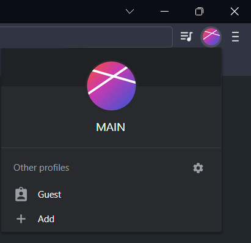
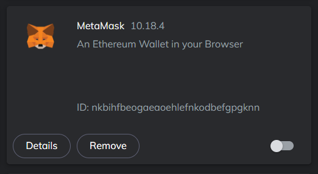
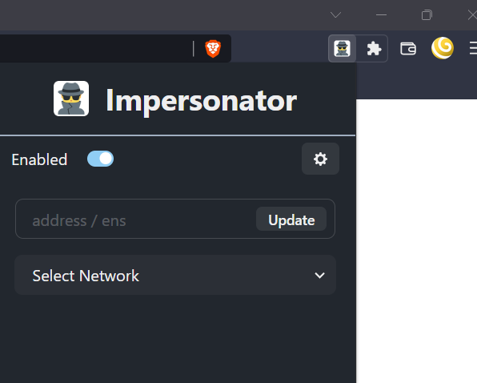
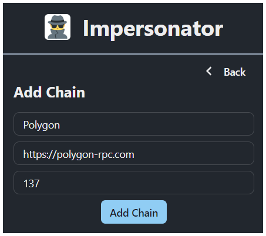
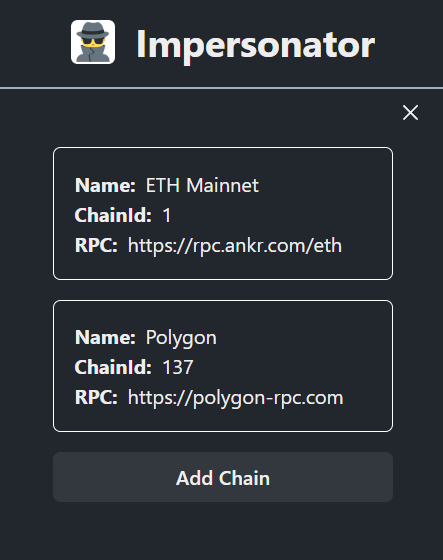
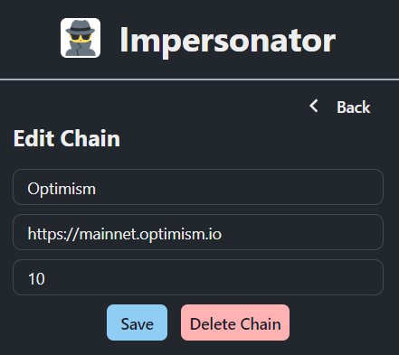
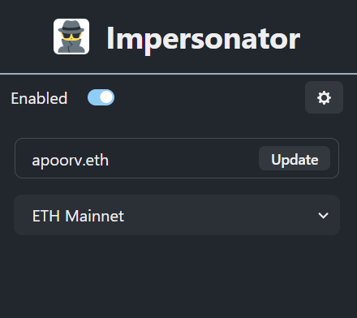

# Impersonator Extension

<i><b>Log-in as ANY address on ALL dapps.</b></i> 
 
Impersonator injects into the dapps just like Metamask, but gives you the freedom to set custom address which tricks the dapp into thinking you own that address.

## How to Install

<ol>
  <li>
    Download extension from the <a href="https://chrome.google.com/webstore/detail/impersonator/hgihfkmoibhccfdohjdbklmmcknjjmgl">Chrome Web Store</a>
  </li>

  <li> 
    <b>NOTE:</b> Extension should not be installed along with Metamask, here are 3 different ways to avoid it: 
    <ol type="a">
      <li>
        Create a new browser profile  
        
      </li>
      <li>
        OR disable Metamask when using Impersonator  
        
      </li>
      <li>
        OR use a different browser.
      </li>
    </ol>
  </li>
</ol>

## Using the Extension

1. Click on 🕵️ icon in the extensions bar to open Impersonator popup  
   
2. Open settings -> "Add Chain" button 
   Fill Chain Name, Paste RPC URL and the Chain Id would get auto filled. Press "Add Chain".  
   
3. You can view all the saved chains in the Settings tab  
   
4. Clicking on any of the chains would open up the Edit page. You can modify or delete the chain.  
   
5. On the homepage, you can enter address or ENS. Select preferred network and set the Enabled toggle.  
   
6. You can now open any dapp and connect wallet as Metamask. The dapp would detect your custom address and network.

 
⭐ Unique feature that differentiates it from other wallets: <b>You can have different address & chain injected in different browser tabs at the same time! </b>  
So in one tab you might have Uniswap connected to <code>Polygon</code> with <code>apoorv.eth</code> and in another one you can have Sushiswap connected to <code>Ethereum Mainnet</code> with <code>vitalik.eth</code>
